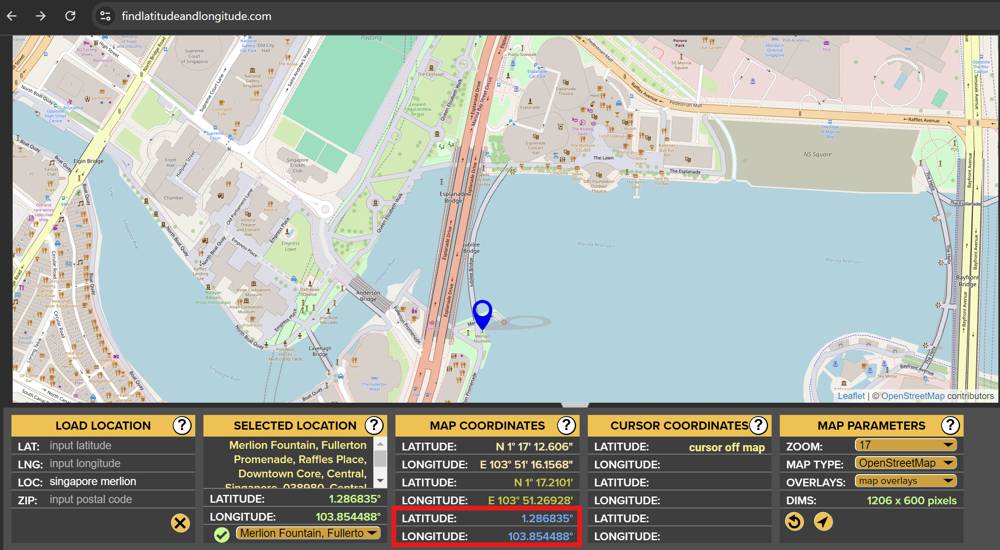

# OptiRouteX

OptiRouteX is a program designed to optimize and calculate the shortest possible route between specified locations using genetic algorithms. The program uses latitude and longitude coordinates for various waypoints, an origin, and a destination to determine the optimal path.

## Getting Started

### 1. Setting Up the Locations

Before running the program, ensure that the locations are properly set up in the JSON file located at `./models/locations.json`. The JSON file should follow this structure:

```json
{
  "origin": {
    "lat": 1.292982,
    "lng": 103.857003,
    "//": "Suntec City"
  },
  "destination": {
    "lat": 1.300639,
    "lng": 103.854837,
    "//": "Bugis Junction"
  },
  "waypoints": {
    "Merlion": {
      "lat": 1.28668,
      "lng": 103.853607
    },
    "313 Somerset": {
      "lat": 1.301114,
      "lng": 103.838872
    },
    "Marina Bay Sands": {
      "lat": 1.28437,
      "lng": 103.8599
    },
    "Gardens by the Bay": {
      "lat": 1.281517,
      "lng": 103.865774
    },
    "Singapore Flyer": {
      "lat": 1.289299,
      "lng": 103.863137
    }
  }
}
```

#### Important Notes:

- **Do Not Change the "origin" and "destination" Keys**: The keys `"origin"` and `"destination"` are required by the program. **Only change the `lat`, `lng`, and `//` values** under these keys to update the coordinates and description.

- **Waypoints Formatting**: For the waypoints, you can customize the name of each waypoint as a key (e.g., `"Merlion"`, `"313 Somerset"`) and provide the corresponding `lat` and `lng` values. Ensure that each waypoint follows this format.

You can obtain the latitude and longitude coordinates from [findlatitudeandlongitude](#https://www.findlatitudeandlongitude.com/) for coordinates.

Here is where you can retrieve the latitude and longitude


### 2. Running the Program

Once your locations are set up, you can run the entire program by executing the following command in your terminal:

```bash
npm run run-all
```

This command will initiate the process, leveraging the specified waypoints and locations to calculate the optimal route.

## Merging Branches to Main

When you're ready to merge changes from the `dev` branch to the `main` branch, follow these steps:

### Step 1: Checkout to the Main Branch

Ensure you are on the `main` branch before merging:

```bash
git checkout main
```

### Step 2: Merge the `dev` Branch into `main`

Merge the changes from the `dev` branch into the `main` branch:

```bash
git merge dev
```

### Step 3: Push the Changes to the Remote `main` Branch

Finally, push the merged changes to the origin's `main` branch:

```bash
git push origin main
```

## Notes

- Ensure all configurations and settings are correctly set before running the program.
- Regularly update the `locations.json` file to reflect any changes in your waypoints or geographical data.
- **Do not change the `"origin"` and `"destination"` keys**—only update their `lat`, `lng`, and `//` values.
- Waypoints should be formatted with the location name as the key, followed by `lat` and `lng` values.
